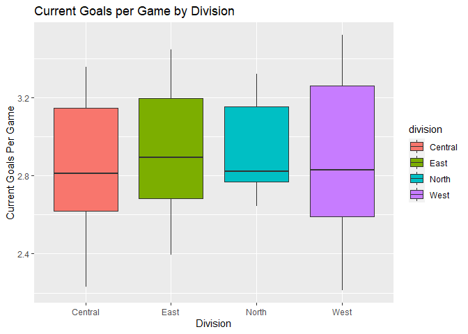

Project 1: NHL API Access and Analysis
================
Lee Pixton
6/20/2021

# NHL API Connection Functions

This is the first project for the course ST558 (Data Science for
Statisticians) at NC State University. In this vignette, we will discuss
reading data from the National Hockey League (NHL) API through user
functions, and then provide summaries and an exploratory analysis of the
data pulled.

## Required Project Packages

In order to run the code for the project, you will need the packages
listed below. Code for the installation of these packages is included.
Be sure to run that portion if you are following along!

-   httr
-   knitr
-   ggrepel
-   RSQlite
-   jsonlite
-   tidyverse
-   rmarkdown

### Installing required packages

To install the packages required for this project, use the code chunk
below. The `library` functions will read the packages into your R
environment once they are installed and allow you to access their
functions.

``` r
install.packages("knitr", "httr", "ggrepel", "RSQlite", "jsonlite",
                 "rmarkdown", "tidyverse")
library(httr)
library(knitr)
library(ggrepel)
library(RSQLite)
library(jsonlite)
library(rmarkdown)
library(tidyverse)
```

## Function to Contact the Franchise API

First thing to do is create a function that can access the franchise
records API. This will allow us to pull any number of information about
each franchise. The `extension` option in the function takes in one of
the following:

-   `franchise` - Returns id, firstSeasonId and lastSeasonId and name of
    every team in the history of the NHL
-   `franchise-team-totals` - Returns total stats for every franchise
    (ex roadTies, roadWins, etc)
-   `franchise-season-records` - Returns drill-down into season records
    for a specific franchise
-   `franchise-goalie-records` - Returns goalie records for the
    specified franchise
-   `franchise-skater-records` - Returns skater records, same
    interaction as goalie endpoint
-   `franchise-detail` - Returns captainHistory, coachingHistory,
    generalManagerHistory and a summary of retired numbers

And the `ID` option is available for specifying a team.

``` r
# This function is used to take input from the user 
# and return appropriate data from the NHL franchise API
franchiseAPI <- function(extension, ID = NULL){
  base <- "https://records.nhl.com/site/api/"

  if(!is.null(ID)){
    if(extension == "franchise" | extension == "franchise-team-totals"){
      warning("ID is not allowed for these calls, will return ", extension, "without ID")
      URL <- paste0(base, extension)
    } else if(extension == "franchise-detail"){
      URL <- paste0(base, extension, "?cayenneExp=mostRecentTeamId=", ID) 
    } else{
      URL <- paste0(base, extension, "?cayenneExp=franchiseId=", ID)
    }
  } else{
    URL <- paste0(base, extension) 
  }
  
  # Access API and convert data to tibble
  getNHL <- GET(URL)
  nhlText <- content(getNHL, "text")
  nhlJson <- fromJSON(nhlText, flatten=T)
  return(tbl_df(nhlJson$data))
}
```

### ID Mapping Table

Once we have this function, we can put together a mapping from team name
to ID number. This allows the user to input the team name without having
to know the specific ID. We will use our API call to retrieve this
information into a dataframe, that we can then use to complete a mapping
in the wrapper function. The user will be able to use the full name, the
abbreviation, or just the mascot to pull the ID.

``` r
# Pull mapping table and subset to columns needed
teamMapping <- franchiseAPI("franchise")
teamMapping <- teamMapping %>% 
  select(mostRecentTeamId, fullName, teamAbbrev, teamCommonName) %>% 
  rename(teamID = mostRecentTeamId) %>% arrange(teamID)
kable(teamMapping)
```

| teamID | fullName              | teamAbbrev | teamCommonName |
|-------:|:----------------------|:-----------|:---------------|
|      1 | New Jersey Devils     | NJD        | Devils         |
|      2 | New York Islanders    | NYI        | Islanders      |
|      3 | New York Rangers      | NYR        | Rangers        |
|      4 | Philadelphia Flyers   | PHI        | Flyers         |
|      5 | Pittsburgh Penguins   | PIT        | Penguins       |
|      6 | Boston Bruins         | BOS        | Bruins         |
|      7 | Buffalo Sabres        | BUF        | Sabres         |
|      8 | Montréal Canadiens    | MTL        | Canadiens      |
|      9 | Ottawa Senators       | OTT        | Senators       |
|     10 | Toronto Maple Leafs   | TOR        | Maple Leafs    |
|     12 | Carolina Hurricanes   | CAR        | Hurricanes     |
|     13 | Florida Panthers      | FLA        | Panthers       |
|     14 | Tampa Bay Lightning   | TBL        | Lightning      |
|     15 | Washington Capitals   | WSH        | Capitals       |
|     16 | Chicago Blackhawks    | CHI        | Blackhawks     |
|     17 | Detroit Red Wings     | DET        | Red Wings      |
|     18 | Nashville Predators   | NSH        | Predators      |
|     19 | St. Louis Blues       | STL        | Blues          |
|     20 | Calgary Flames        | CGY        | Flames         |
|     21 | Colorado Avalanche    | COL        | Avalanche      |
|     22 | Edmonton Oilers       | EDM        | Oilers         |
|     23 | Vancouver Canucks     | VAN        | Canucks        |
|     24 | Anaheim Ducks         | ANA        | Ducks          |
|     25 | Dallas Stars          | DAL        | Stars          |
|     26 | Los Angeles Kings     | LAK        | Kings          |
|     28 | San Jose Sharks       | SJS        | Sharks         |
|     29 | Columbus Blue Jackets | CBJ        | Blue Jackets   |
|     30 | Minnesota Wild        | MIN        | Wild           |
|     37 | Hamilton Tigers       | HAM        | Tigers         |
|     39 | Philadelphia Quakers  | QUA        | Quakers        |
|     41 | Montreal Wanderers    | MWN        | Wanderers      |
|     43 | Montreal Maroons      | MMR        | Maroons        |
|     45 | St. Louis Eagles      | SLE        | Eagles         |
|     49 | Cleveland Barons      | CLE        | Barons         |
|     51 | Brooklyn Americans    | BRK        | Americans      |
|     52 | Winnipeg Jets         | WPG        | Jets           |
|     53 | Arizona Coyotes       | ARI        | Coyotes        |
|     54 | Vegas Golden Knights  | VGK        | Golden Knights |
|     55 | Seattle Kraken        | SEA        | Kraken         |

## Function to Contact the Stats API

Next we need a function to access the stats API. Though there are many
modifiers available to access multiple data sets, for our purposes we
will only provide access to the `?expand=team.stats` modifier. By
providing an `ID`, it will pull specific team data, but the function
alone will pull data on all the teams.

``` r
# This function is used to take user input and output a tibble 
# with data from the NHL Stats API
statsAPI <- function(ID = NULL){
  base <- "https://statsapi.web.nhl.com/api/v1/teams?expand=team.stats"
  if(!is.null(ID)){
    URL <- paste0(base,"=",ID)
  } else{
    URL <- paste0(base)
  }
  
  getStats <- GET(URL)
  statsText <- content(getStats, "text")
  statsJson <- tbl_df(fromJSON(statsText, flatten=T))
  statsData <- statsJson$teams$teamStats
  
  if(!is.null(ID)){
    statsData <- statsJson$teams$teamStats[statsJson$teams$id == ID]
    endData <- statsData[[1]]$splits[[1]]
  } else{
    endData <- statsData[[1]]$splits[[1]]
    
    for(i in c(2:length(statsData))){
      statsData <- statsJson$teams$teamStats
      endData <- rbind(endData,statsData[[i]]$splits[[1]])
    }
  }
  return(tbl_df(endData))
}
```

## Wrapper Function for Both API Calls

Here we create a function that takes in the user input specific to
either API.

``` r
# Allows for one function call to query either API
access_NHL_API <- function(extension, ID = NULL, ...){
  # Output list to global environment to allow for troubleshooting
  extensionList <<- c('franchise', 'franchise-team-totals', 
                      'franchise-season-records',  
                      'franchise-goalie-records', 
                      'franchise-skater-records',
                      'franchise-detail', "stats")
  
  # Check user input
  if(is.null(extension) | !(extension %in% extensionList)){
    stop("Must include a valid extension. Please see extensionList for valid inputs.")
  }
  
  # Convert ID to numeric value
  if(!is.numeric(ID) & !is.null(ID)){
    if(length(which(teamMapping$fullName == ID)) == 0){
      i <- which(teamMapping$fullName == ID)
    } else if(length(which(teamMapping$teamAbbrev == ID)) == 0){
      i <- which(teamMapping$teamAbbrev == ID)
    } else if(length(which(teamMapping$teamCommonName == ID)) == 0){
      i <- which(teamMapping$teamAbbrev == ID)
    } else{
      stop("Team ID not found!")
    }
  }
  
  if(extension == 'stats'){
    if(!is.null(ID)){
      ID <- teamMapping$teamAbbrev[i]
    }
    return(statsAPI(ID))
  } else {
    if(!is.null(ID)){
      ID = i
    }
    return(franchiseAPI(extension,ID))
  }
}
```

# NHL Data Analysis Using Our API

Now that we have access to the API, we first need to pull some data to
analyze. We will pull franchise data, team totals, and current season
stats. We will conduct some filtering here to make the join simpler.

``` r
franchise <- access_NHL_API("franchise") %>% 
  select(!(lastSeasonId | id))
team_totals <- access_NHL_API("franchise-team-totals") %>% 
  filter(gameTypeId == 2 & activeFranchise == 1 & is.na(lastSeasonId)) %>% 
  select(!(ends_with("SeasonId") | id))
stats <- access_NHL_API("stats") %>% 
  filter(!is.na(stat.gamesPlayed))
```

## Combining Data

Next we need to combine these data together using `join` functions.

``` r
finalData <- right_join(franchise, team_totals, 
                         by = c("mostRecentTeamId" = "teamId")) %>% 
  inner_join(stats, by = c("teamName" = "team.name")) 
```

## Adding Columns

In this section we will do some calculations to add a couple columns of
interest. We will then filter on these columns of interest plus some
existing columns to create a final dataframe. As description of our
changes is below:

-   `division` - Which division the team is a part of
-   `seasonsInLeague` - How many seasons the team has been in the league
-   `currentWinPerc` - Win percentage of the current season
-   `currentGoalDiff` - Goal differential (team goals scored - team
    goals allowed) for current season
-   `histWinPerc` - Historic win percentage
-   `histGoalsPerGame` - Historic goals per game
-   `histGoalDiff` - Historic goal differential
-   `winPercDiff` - Difference between current season win percentage and
    historic
-   `seasonGoalDiff` - Difference between current goal differential and
    historic
-   `goalsPerGameDiff` - The difference between the current season goals
    per game and historic

The first 6 columns of the dataframe are below.

``` r
finalData$firstSeason <- as.integer(substr(as.character(finalData$firstSeasonId),1,4))

central <- c("CAR","CHI","CBJ","DAL","DET","FLA","NSH","TBL")
east <- c("BOS","BUF","NJD","NYI","NYR","PHI","PIT","WSH")
west <- c("LAK","COL","ARI","SJS","ANA","MIN","VGK","STL")
north <- c("TOR","MTL","VAN","CGY","EDM","OTT","WPG")

finalData <- finalData %>%
  mutate(
    division = case_when(
      teamAbbrev %in% central ~ "Central",
      teamAbbrev %in% east ~ "East",
      teamAbbrev %in% west ~ "West",
      teamAbbrev %in% north ~ "North"
    ),
    seasonsInLeague = 2021 - firstSeason,
    currentWinPerc = as.integer(stat.wins) / stat.gamesPlayed,
    currentGoalDiff = as.numeric(stat.goalsPerGame) - as.numeric(stat.goalsAgainstPerGame),
    histWinPerc = wins / gamesPlayed,
    histGoalsPerGame = goalsFor / gamesPlayed,
    histGoalDiff = histGoalsPerGame - (goalsAgainst / gamesPlayed),
    winPercDiff = currentWinPerc - histWinPerc,
    seasonGoalDiff = currentGoalDiff - histGoalDiff,
    goalsPerGameDiff = as.numeric(stat.goalsPerGame) - histGoalsPerGame
  ) %>% 
  select(fullName,teamAbbrev,division, seasonsInLeague, 
         gamesPlayed, goalsFor, goalsAgainst, 
         histGoalsPerGame, histGoalDiff, wins, losses, 
         histWinPerc, stat.wins, stat.losses, 
         currentWinPerc, stat.goalsPerGame, 
         stat.goalsAgainstPerGame, currentGoalDiff, 
         winPercDiff, seasonGoalDiff, goalsPerGameDiff)

kable(finalData[,1:6])
```

| fullName              | teamAbbrev | division | seasonsInLeague | gamesPlayed | goalsFor |
|:----------------------|:-----------|:---------|----------------:|------------:|---------:|
| Montréal Canadiens    | MTL        | North    |             104 |        6787 |    21791 |
| Toronto Maple Leafs   | TOR        | North    |             104 |        6516 |    19980 |
| Boston Bruins         | BOS        | East     |              97 |        6626 |    21112 |
| New York Rangers      | NYR        | East     |              95 |        6560 |    20041 |
| Chicago Blackhawks    | CHI        | Central  |              95 |        6560 |    19537 |
| Detroit Red Wings     | DET        | Central  |              95 |        6293 |    19550 |
| Los Angeles Kings     | LAK        | West     |              54 |        4172 |    13053 |
| Dallas Stars          | DAL        | Central  |              54 |        2109 |     6022 |
| Philadelphia Flyers   | PHI        | East     |              54 |        4171 |    13690 |
| Pittsburgh Penguins   | PIT        | East     |              54 |        4171 |    13874 |
| St. Louis Blues       | STL        | West     |              54 |        4173 |    12827 |
| Buffalo Sabres        | BUF        | East     |              51 |        3945 |    12471 |
| Vancouver Canucks     | VAN        | North    |              51 |        3945 |    12138 |
| Calgary Flames        | CGY        | North    |              49 |        3154 |    10257 |
| New York Islanders    | NYI        | East     |              49 |        3788 |    12045 |
| New Jersey Devils     | NJD        | East     |              47 |        2993 |     8792 |
| Washington Capitals   | WSH        | East     |              47 |        3633 |    11516 |
| Edmonton Oilers       | EDM        | North    |              42 |        3235 |    10776 |
| Carolina Hurricanes   | CAR        | Central  |              42 |        1812 |     4914 |
| Colorado Avalanche    | COL        | West     |              42 |        1978 |     5857 |
| Arizona Coyotes       | ARI        | West     |              42 |         536 |     1345 |
| San Jose Sharks       | SJS        | West     |              30 |        2274 |     6490 |
| Ottawa Senators       | OTT        | North    |              29 |        2195 |     6250 |
| Tampa Bay Lightning   | TBL        | Central  |              29 |        2194 |     6216 |
| Anaheim Ducks         | ANA        | West     |              28 |        2111 |     5693 |
| Florida Panthers      | FLA        | Central  |              28 |        2109 |     5665 |
| Nashville Predators   | NSH        | Central  |              23 |        1731 |     4730 |
| Winnipeg Jets         | WPG        | North    |              22 |         749 |     2209 |
| Columbus Blue Jackets | CBJ        | Central  |              21 |        1568 |     4092 |
| Minnesota Wild        | MIN        | West     |              21 |        1567 |     4166 |
| Vegas Golden Knights  | VGK        | West     |               4 |         291 |      939 |

## Exploratory Data Analysis

Now that we have our data set with 31 rows and 20 columns, we are ready
and able to perform exploratory data analysis (EDA).

### Summary of Team Age

It can be interesting to see the spread of current teams and how long
they have been in the league. Below we can see that the max is 104
seasons with the minimum being just 4. The average number of seasons in
the NHL is just over 50.

``` r
# Summary table for seasons in league
kable(as.data.frame(unclass(summary(finalData$seasonsInLeague))),col.names = "Summary")
```

|         |   Summary |
|:--------|----------:|
| Min.    |   4.00000 |
| 1st Qu. |  29.00000 |
| Median  |  47.00000 |
| Mean    |  50.22581 |
| 3rd Qu. |  54.00000 |
| Max.    | 104.00000 |

#### Histogram of Seasons

We can further explore this with a histogram.

``` r
# Histogram of seasons in the league
g <- ggplot(finalData, aes(x = seasonsInLeague))
g + geom_histogram(binwidth = 10,color="black",fill="lightblue") +
  geom_vline(aes(xintercept=mean(seasonsInLeague)),color = "red", linetype="dashed",size = 1)  + 
  labs(x = "Seasons in the NHL",title = "Histogram of the Number of Seasons in the NHL")
```

<!-- -->

### Goal Differentials

Now we want to explore goal differentials, and see how goal differential
affects win percentage. In the table below, we can see that having a
positive goal differential in general will lead to a win percentage
above 50%. There is one team that has been scored on more than they have
scored and still has a win percentage above 50%, and 2 that are in the
same position on the opposite spectrum, but overall scoring more goals
leads to winning more games.

``` r
# Table comparing current goal differential and current win percentage
kable(table(finalData %>% mutate(
    positiveGoalDiff = ifelse(currentGoalDiff > 0,"Positive Goal Diff","Negative Goal Diff"),
    winsAbove500 = if_else(currentWinPerc > 0.5,"Above .500","Below .500")) %>%
  select(positiveGoalDiff,winsAbove500)))
```

|                    | Above .500 | Below .500 |
|:-------------------|-----------:|-----------:|
| Negative Goal Diff |          1 |         15 |
| Positive Goal Diff |         13 |          2 |

### Historic Win Percentages

In this case, we will just look at the comparison between a team’s
historic win percentage and the current season’s percentage. We can see
that about half of the teams are exceeding their historic win rates,
while the other half are falling behind.

``` r
# Table for win percentage and seasons in league
kable(finalData %>% 
        select(teamAbbrev, seasonsInLeague, histWinPerc, 
               currentWinPerc, winPercDiff) %>% 
        arrange(desc(winPercDiff)))
```

| teamAbbrev | seasonsInLeague | histWinPerc | currentWinPerc | winPercDiff |
|:-----------|----------------:|------------:|---------------:|------------:|
| FLA        |              28 |   0.4215268 |      0.6607143 |   0.2391875 |
| PIT        |              54 |   0.4562455 |      0.6607143 |   0.2044688 |
| TBL        |              29 |   0.4489517 |      0.6428571 |   0.1939055 |
| COL        |              42 |   0.5091001 |      0.6964286 |   0.1873285 |
| CAR        |              42 |   0.4564018 |      0.6428571 |   0.1864554 |
| TOR        |             104 |   0.4409147 |      0.6250000 |   0.1840853 |
| WSH        |              47 |   0.4679328 |      0.6428571 |   0.1749243 |
| EDM        |              42 |   0.4540958 |      0.6250000 |   0.1709042 |
| MIN        |              21 |   0.4843650 |      0.6250000 |   0.1406350 |
| NYI        |              49 |   0.4456177 |      0.5714286 |   0.1258108 |
| VGK        |               4 |   0.5945017 |      0.7142857 |   0.1197840 |
| BOS        |              97 |   0.4891337 |      0.5892857 |   0.1001520 |
| NSH        |              23 |   0.4922010 |      0.5535714 |   0.0613704 |
| NYR        |              95 |   0.4394817 |      0.4821429 |   0.0426611 |
| ARI        |              42 |   0.3992537 |      0.4285714 |   0.0293177 |
| WPG        |              22 |   0.5100134 |      0.5357143 |   0.0257009 |
| STL        |              54 |   0.4622574 |      0.4821429 |   0.0198855 |
| CHI        |              95 |   0.4286585 |      0.4285714 |  -0.0000871 |
| VAN        |              51 |   0.4179975 |      0.4107143 |  -0.0072832 |
| CGY        |              49 |   0.4746354 |      0.4642857 |  -0.0103497 |
| OTT        |              29 |   0.4423690 |      0.4107143 |  -0.0316547 |
| LAK        |              54 |   0.4204219 |      0.3750000 |  -0.0454219 |
| PHI        |              54 |   0.4984416 |      0.4464286 |  -0.0520130 |
| MTL        |             104 |   0.5117136 |      0.4285714 |  -0.0831421 |
| SJS        |              30 |   0.4705365 |      0.3750000 |  -0.0955365 |
| DAL        |              54 |   0.5139877 |      0.4107143 |  -0.1032734 |
| CBJ        |              21 |   0.4323980 |      0.3214286 |  -0.1109694 |
| DET        |              95 |   0.4593993 |      0.3392857 |  -0.1201136 |
| NJD        |              47 |   0.4657534 |      0.3392857 |  -0.1264677 |
| ANA        |              28 |   0.4689721 |      0.3035714 |  -0.1654006 |
| BUF        |              51 |   0.4575412 |      0.2678571 |  -0.1896840 |

#### Win Percentages Scatter Plot

We can observe this in a scatter plot as well, using `ggplot2`. Adding
the division coloring shows that some of the west division teams are the
most successful in the league both currently and historically. It
appears that this success comes at the expense of others in that
division, as there are a few West division teams falling to the bottom
of the spectrum.

``` r
# Scatter plot
g1 <- ggplot(finalData, aes(x = histWinPerc, y = currentWinPerc, group=division))
g1 + geom_point(aes(color=division)) + 
  labs(x = "Historic Win Percentage", y = "Current Win Percentage", 
       title = "Comparing Win Percentages")
```

<!-- -->

### Goals by Division

Next we will look at goals scored by division. First we will subset our
dataframe and group by division.

``` r
goals <- finalData %>% 
  group_by(division) %>% 
  select(division, teamAbbrev, goalsFor, goalsAgainst,
         histGoalsPerGame, stat.goalsPerGame,currentGoalDiff)
```

Now we can look at some data within these divisions. First we will look
at the performance historically versus this season. We can see that the
Central division is performing the best compared to their historical
performance, but the other three divisions actually have more goals per
game this season than the Central. It is interesting to see such high
numbers of goals scored historically in the North and East, with the
numbers down significantly this year compared to average.

``` r
# Create and display goal differential table
goalDiff <- goals %>% 
  summarise(currentGoalsPerGame = mean(as.numeric(stat.goalsPerGame)), 
            histGoalsPerGame = mean(histGoalsPerGame), 
            difference = mean(as.numeric(stat.goalsPerGame)) - mean(histGoalsPerGame)) %>%
  arrange(desc(difference))
kable(goalDiff)
```

| division | currentGoalsPerGame | histGoalsPerGame | difference |
|:---------|--------------------:|-----------------:|-----------:|
| Central  |            2.830250 |         2.814205 |  0.0160454 |
| West     |            2.892875 |         2.888642 |  0.0042327 |
| North    |            2.946429 |         3.104796 | -0.1583678 |
| East     |            2.928500 |         3.162263 | -0.2337627 |

#### Goals by Division Box Plots

Next we can show a box plot of this data to compare the spread of the
divisions. We can look at both the historic and current data.

``` r
# Box plots for goals per game
g2 <- ggplot(goals, aes(x = division, y = histGoalsPerGame, fill = division))
g2 + geom_boxplot(outlier.colour="red") + 
  labs(x = "Division", y = "Historic Goals Per Game", 
       title = "Historic Goals per Game by Division")
```

<!-- -->

The historic data has a wide IQR in the West and very slim IQR in the
East. There appear to be outliers in the East division though. The
current data is surprisingly uniform throughout, signifying that the
average goals in the current season is similar across all divisions, and
there is an even spread of high and low scoring teams in each.

``` r
g3 <- ggplot(goals, aes(x = division, y = as.numeric(stat.goalsPerGame), fill = division))
g3 + geom_boxplot(outlier.colour="red") + 
  labs(x = "Division", y = "Current Goals Per Game", 
       title = "Current Goals per Game by Division")
```

<!-- -->

### Number of teams per Division

Because of the current state of the league, there are only 31 teams.
This causes an uneven number of teams between divisions until the
Seattle Kraken join next year. To explore this, we will simply display a
table. As we see below, the North Division is one team short of the
others. This is an interesting fact to note, as looking at the previous
analysis the North division does have the smallest current IQR for goals
per game. It is possible this has something to do with having fewer
teams, but nothing can be concluded during this analysis. Just something
to be aware of in further study.

``` r
kable(table(goals$division),col.names = c("Division","Count"))
```

| Division | Count |
|:---------|------:|
| Central  |     8 |
| East     |     8 |
| North    |     7 |
| West     |     8 |

### Total Franchise Goals

#### Franchise Goals Bar Plot

The last thing we will explore here is historic franchise goals. This
will be skewed due to the large variability between seasons in the
league, but will be interesting to explore regardless. We will first use
a bar plot, followed by a scatter plot to explore this.

``` r
# Bar chart for goals, subsetting data first
barData <- finalData %>% 
  select(teamAbbrev, goalsFor, goalsAgainst, seasonsInLeague) %>% 
  arrange(desc(goalsFor))
g4 <- ggplot(barData,aes(x = reorder(teamAbbrev, -goalsFor), y = goalsFor))
g4 + geom_bar(stat="identity", color = "black", fill = "lightblue") +
  theme(axis.text.x = element_text(angle=90,hjust=1,vjust=0.5)) +
  labs(x = "Team", y = "Total Franchise Goals", title = "Total Franchise Goals by Team")
```

<!-- -->

#### Franchise Goals Scatter Plot

Finally, we will compare the number of seasons in the league per team to
the total franchise goals. Here we can see as expected, those with the
highest number of goals have been in the league the longest. There are a
few outliers though, specifically DAL, WPG, and ARI that appear to have
a far fewer goals than expected for the number of seasons they have been
in the league.

``` r
g5 <- ggplot(barData, aes(x = seasonsInLeague, y = goalsFor))
g5 + geom_point() + 
  labs(x = "Total Seasons in the NHL", y = "Total Franchise Goals",
       title = "Comparing Franchise Goals to Length of Tenure in the NHL") +
  geom_label_repel(label=barData$teamAbbrev, fill="lightblue") +
  theme(legend.position = "none")
```

<!-- -->

# Conclusion

This is just the beginning of what can be done with this data. Now that
you know how to access this API and write your own functions to do so,
you have the NHL at your fingertips! EDA is the beginning of any good
data science project, and now we have a good idea behind the data we
have collected here. This data can now be used for regression,
prediction, any number of things! If you enjoyed this post, stay tuned
to my [blog](pseudonym-code.github.io) as I will be posting more
projects and tutorials like this one!
